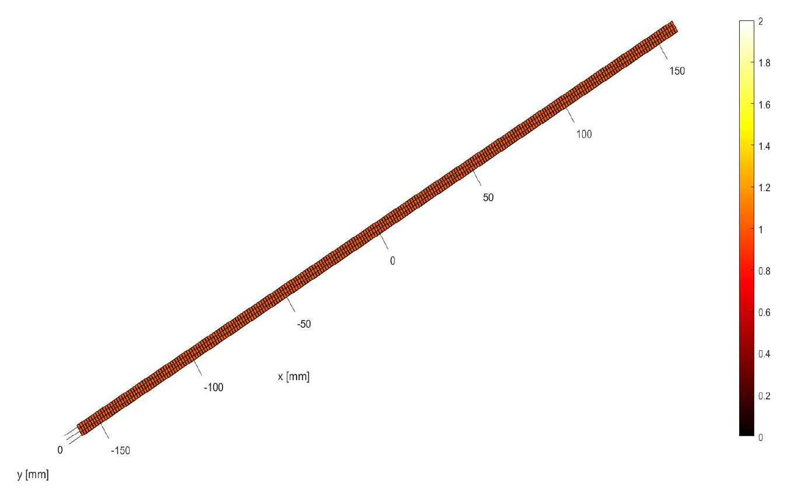
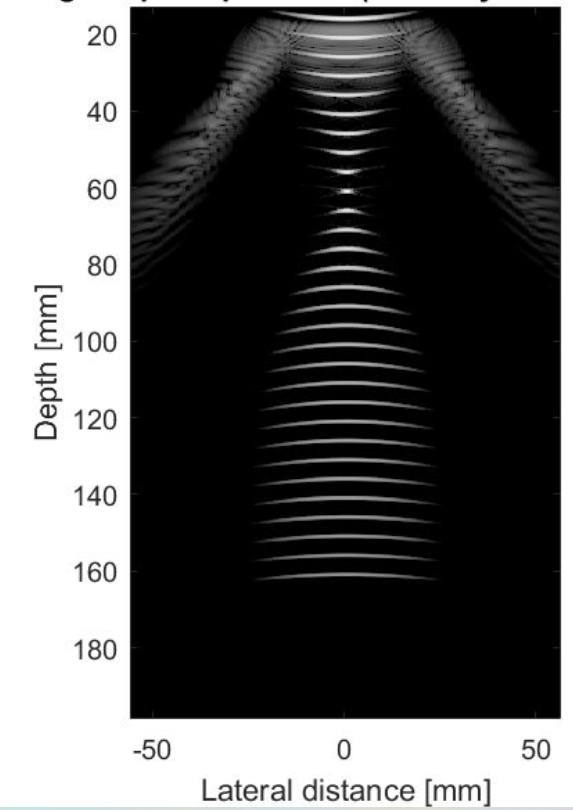
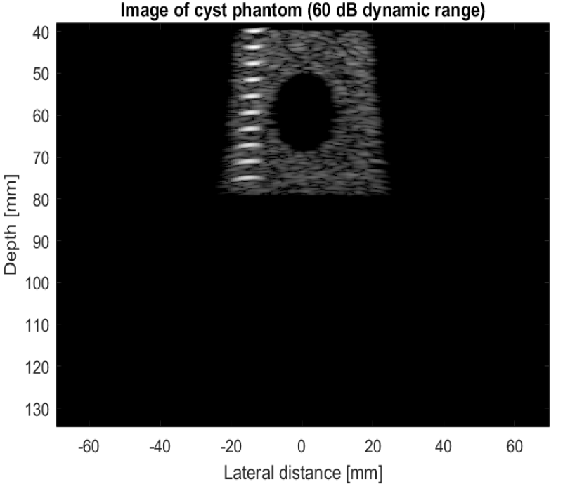

# Ultrasound-Field-II

Field II is a widely used and versatile ultrasound simulation software package that is employed in the field of medical ultrasound imaging. It's a comprehensive tool designed for simulating ultrasound propagation and interaction with tissue.It is often used in Diagnostic Ultrasound. In this project, I simulated a linear array imaging with center frequency 2.5 MHz  and sampling frequency of 100 MHz. The Transducer array  consists of 256 elements. The Simulation is on the scanning of an Artificial Cyst Phantom.  The Matlab files for this project can be found [here](https://github.com/dhanushpittala11/Ultrasound-Field-II/tree/main/codes).

## Linear Array Transducer

## Beamforming

Plane Wave Beam Forming.

Wave Focusing Beam Forming.

## Image Of Cyst Phantom

